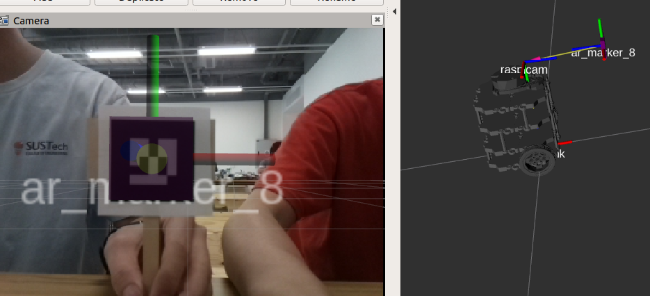

<h1 style="text-align: center"> Capstone Competition </h1>
<div style="text-align: center"><small>Ruidi PENG | Xiang YU</small></div>

---


* TOC
{:toc}
---

# Introduction

In this competition, our goal is to navigate our robot racing around several points as fast as possible while recognizing the AR codes. To start with, a global map is built using Adaptive Monte Carlo Localization (AMCL) and Gmapping. Then, we need to plan the path by setting some points in our local map. Turtlebot is navigated to these points using `move_base` while reading out AR tags it sees.

<p align="center">
  
</p>


# Competition Rules

This competition has two rounds. The first round is fixed-point path finding. The robot should start from PS1 and visit PS2, PS3, and PS4 in turn,  as well as searching for the two SS’s and reporting/signaling their numbers when they are found. Every PS and SS worth 10 points.

The second round is setting the path by ourselves and reach as many targets as possible in 3 minutes. The only requirement is that the robot must alternate tasks between the left half and the right half of the turtle nest, and the first point is PS1. (e.g., we choose path PS1->SS1->PS2->PS3->SS2). Every PS and SS worth 10 points, and the final score is according to the rank of all the teams.

# Experimental Platform

## Turtlebot3

In this project, we choose turtlebot3-burger as our robot. You can find the details [here](https://emanual.robotis.com/docs/en/platform/turtlebot3/overview/).

<p align="center">
	
</p>


Turtlebot3 is a small, low cost, fully programmable, ROS-based mobile robot. It combined with chassis, motor, wheels, OpenCR board, computer(Raspberry Pi), sensor(LiDAR, camera), battery.

This robot can complete many project, which includes: movement operation, forward, backward, left and right turn, rotate in place, GMapping algorithm map building, autonomous navigation. After installing camera for Raspberry Pi, we can use it to do some visual projects.

## Sensors

In this competition, LiDAR and camera will be used. They collect data and send to the Raspberry Pi. The the Raspberry Pi will communicate with remote PC with the help of Wi-Fi.

The laser distance sensor we use is LDS-01. It is a 2D laser scanner capable of sensing 360 degrees that collects a set of data around the robot to use for SLAM (Simultaneous Localization and Mapping) and Navigation. More details could be found [here](https://emanual.robotis.com/docs/en/platform/turtlebot3/appendix_lds_01/).

<p align="center"></p>


Our camera is a simple csi camera. We only need to recognize the AR code so there is no need to use nicer and more expensive camera. After calibration, we can use it for AR code detection.

## On-board Computer

We use Raspberry Pi as the on-board computer for Turtlebot3. It's a very small computer with the size of a credit card. We install Ubuntu 18.04 and ROS Melodic on it. The communication between Raspberry Pi and remote PC is based on Wi-Fi. We can use `ssh pi@[raspberry pi address]`to connect to Raspberry Pi under the same network. It can send command to OpenCR through the USB host, and OpenCR give the motor signal to control robots speed and direction.

<p align="center"></p>


For more info on Raspberry Pi set up, read [here](https://emanual.robotis.com/docs/en/platform/turtlebot3/sbc_setup/#sbc-setup).

## ROS

[ROS (Robot operating system)](https://www.ros.org/) is a highly flexible software architecture for writing robot software programs. It contains a wealth of tools, library code, and conventions designed to simplify the process of creating complex, robust robot behavior across robotics platforms. ROS provides some standard operating system services, such as hardware abstraction, low-level device control, common function implementation, interprocess messaging, and packet management. ROS is based on a graphical architecture that enables processes at different nodes to receive, publish, and aggregate information (such as sensing, control, state, planning, etc.).

In this project, we will use ros-melodic on Ubuntu to manage sensor message and robot motion. We can check the `rqt_graph` to see the overall structure of our project, which includes all the nodes, topics and messages. It also provide some simulation tools like Gazebo and Rviz, in which we can check the robot status and  build simulation world. 

# File Structure

This section will briefly introduce what is packed in the git repository. The original name of the git root directory is `catkin_ws`, which is a [catkin workspace](http://wiki.ros.org/catkin/workspaces). The directory is created on the remote PC using [`catkin_make`](http://wiki.ros.org/catkin/Tutorials/create_a_workspace). However, for simplicity, we only keep the [source space](http://wiki.ros.org/catkin/workspaces#Source_Space) and ignore all files in [`build/`](http://wiki.ros.org/catkin/workspaces#Build_Space) and [`devel/`](http://wiki.ros.org/catkin/workspaces#Development_.28Devel.29_Space).

[`src/`](http://wiki.ros.org/catkin/workspaces#Source_Space) contains the source code of catkin packages. Each folder within the [source space](http://wiki.ros.org/catkin/workspaces#Source_Space) contains one or more catkin packages. `src/my_nodes` is a package created by us following [this tutorial](http://wiki.ros.org/catkin/Tutorials/CreatingPackage). Other packages are downloaded from open sources. We have modified several parameters and launch files in them for better performance.

`docs/` contains the documentation and website source code.

`other/` contains files that we once possibly used in capstone and previous labs.

`maps/` contains the maps we built for the racing environment using GMapping and laser scan. The maps were put at `/home` directory during competition.

`models & worlds/` contains Gazebo [model](http://gazebosim.org/tutorials?tut=build_model) and [world](http://gazebosim.org/tutorials?tut=build_world) used for simulation test.

# Design and Implementation

## 1. Mapping

We first built maps for the racing environment using GMapping. After controlling the robot running around the competition field, we can get maps as showing below: (Left for simulation, Right for real lab environment)

<p align="center"></p>


The final map is not very precise because of the LiDAR's deviation. We also find that the network also influence the map building. If too many people using the network in the same time, your robot may face packet loss so that the map is incorrect.

<p align="center"></p>


## 2. Navigation

There are two tabs in Rviz panel: 2D Pose Estimate and 2D Nav Goal. When we put the Turtlebot on the filed, we need use the 2D estimate to tell the robot its initial position first. Then we use 2D Nav Goal to give it a goal point. The robot can reach that point after planning the path.

<p align="center"></p>

We can use the 2D Nav Goal in Rviz to make our robot reach a certain point in map. During this process, we can use `rostopic echo /move_base/goal` to find the goal coordinate relative to our map. After finding the suitable coordinates, we can record them and put in `nav_test.py`.

<p align="center"></p>

Similarly, we can use the below code in CLI to publish a goal instead of using 2D Nav Goal.

```python
rostopic pub /move_base/goal move_base_msgs/MoveBaseActionGoal 
"header:
  seq: 0
  stamp:
    secs: 0
    nsecs: 0
  frame_id: ''
goal_id:
  stamp:
    secs: 0
    nsecs: 0
  id: ''
goal:
  target_pose:
    header:
      seq: 0
      stamp:
        secs: 0
        nsecs: 0
      frame_id: 'map'
## edit below
pose:
  position:
    x: 4.33
    y: 3.85
    z: 0.0
  orientation:
    x: 0.0
    y: 0.0
    z: 0.9
    w: -0.418"
```
We only need to change the locations of setting points. The final navigation coordinates in this competition are here:

```python
# 4 Locations for the bigger (default) simulation map
locations['PIT STOP 1'] = Pose(Point(1.6, -2.5, 0.000), Quaternion(0.000, 0.000, 0.733, 0.680))
locations['PIT STOP 2'] = Pose(Point(1.7, 2.5, 0.000), Quaternion(0.000, 0.000, 0.223, 0.975))
locations['PIT STOP 3'] = Pose(Point(-3.3, 2.5, 0.000), Quaternion(0.000, 0.000, -0.670, 0.743))
locations['PIT STOP 4'] = Pose(Point(-3.5, -2.6, 0.000), Quaternion(0.000, 0.000, 0.786, 0.618))
```

## 3. Parameters 

We can further improve the result by changing some of the parameters. Two main parts of parameters can be changed are GMapping and navigation. We can find this parameters in:

`catkin_ws/src/turtlebot3/turtlebot3_slam/config/`  GMapping

`catkin_ws/src/turtlebots/turtlebot3_navigation/param/ `   Navigation

GMapping parameters mainly influence the mapping resolution and map maximum size. We can change them in `gmapping_params.yaml` . `x_min,y_min,x_max,y_max`can change the maximum map size. `delta` controls the mapping resolution. Higher resolution can make your map clearly, at the same time , the map building process will be longer and harder.

When we doing navigation, we need to calculate the cost all the time, so we can also change the parameters in `local_costmap_params.yaml` . `resolution` is the size of the minimum unit of cost map. We first changed it to 0.02 as same as our global map. But the final experiment shows 0.05 is easier for our robot to get out of  the narrow corridor.

<p align="center"></p>


## 4. AR Tag Detection

This is an independent task. We can search the AR tag and make a sound of corresponding numbers. The method is in `ar_track_alver`. We get the AR tag id and use `sound_play`to make sound. We wrote a [listener](https://github.com/readypeng/ee346_remote_pc_catkin_ws/blob/master/src/my_nodes/src/listener.py) to collect all AR code detected and read them out. Open the rviz with following command and we can find the recognition result.

<p align="center"></p>

<p align="center"></p>


Using a lower resolution make the image transmission more robust. And it reduce complexity so that the program does not overheat the remote PC.

## 5. Round 1

Round 1 is the fixed point path finding. We need to set the points in advance using 2D Nav Goal in rviz. Record the `move_base` message and write them in our navigation program. We set some middle points on the map in order to having a better performance of path finding and AR-tag recognition. The path of round 1 is PS1->1->2->3->4->5, and it's showing here:

<p align="center"></p>


## 6. Round 2

Round 2 is a self design task. For more scores we choose PS2 and PS3 as two basic point. Our robots will do back and forth movement between these two points. During this process, SS1 and SS2 also can be detected. So, our final path in this task is PS1->1->2->3->4->1->2->3->4->1->…. 3 minutes is just enough for 2 loops.  PS1 and PS4 is difficult to reach and no extra AR tag scores, so we ignore them.

## 7. Tricks

The navigation program may plan the path automatically, but when we make the robot face right (the narrow channel direction), it is difficult for the robot to get out because the LiDRA deviation and AMCL resolution make effect the judgment of robot. Near the channel a small raise wall will show in local map so the robot cannot go forward, and actually there is nothing. When we try to change the direction of robot, the planning path changes and  avoids the raising wall. 

<p align="center"></p>

# How to Test Our Code

For the purpose of debugging, we do not write a encompassing launch file.

## Test at Real Lab

Run the following code to enable:

### AR-code (run on Remote PC and Turtlebot)

1. (Remote PC) `roscore`
2. (Remote PC) `ssh pi@raspberrypi` and input password to start SSH session with Turtlebot
3. (on connected SSH session) `roslaunch turtlebot3_bringup turtlebot3_robot.launch`
4. (on connected SSH session) `roslaunch raspicam_node camerav2_320x240.launch`
5. (Remote PC) `rosrun image_transport republish compressed in:=raspicam_node/image raw out:=raspicam_node/image`
6. (Remote PC) `roslaunch ar_track_alvar turtlebot3.launch`
7. (Remote PC) `rosrun sound_play soundplay_node.py`
8. (Remote PC) `rosrun my_nodes listener.py`

### Navigation (run on Remote PC)

1. `roslaunch turtlebot3_navigation turtlebot3_navigation.launch map_file:=$HOME/map-capstone-real4.yaml`
2. `rosrun my_nodes nav_test.py`

## Test in Simulation

Before testing, you need to prepare the Gazebo [models](http://gazebosim.org/tutorials?tut=build_model) and [worlds](http://gazebosim.org/tutorials?tut=build_world) used in simulation.

1. add both `/capstone_model` folders in `models & worlds/` to `/src/turtlebot3_simulations/turtlebot3_gazebo/models`
2. add `capstone_world.world` in `models & worlds/` to `/src/turtlebot3_simulations/turtlebot3_gazebo/worlds`
3. add a launch file called `turtlebot3_capstone.launch` in `/src/turtlebot3_simulations/turtlebot3_gazebo/launch`

Launch Gazebo by running: `roslaunch turtlebot3_gazebo turtlebot3_capstone.launch` in the terminal.

### Create map

You can follow the steps below to create a map using Gmapping and LDS.

`roslaunch turtlebot3_slam turtlebot3_slam.launch` Run SLAM

`roslaunch turtlebot3_teleop turtlebot3_teleop_key.launch` Control Turtlebot to run around

`rosrun map_server map_saver -f ~/map-capstone-sim`  Save Map

Alternatively, you can use our map. Simply put `map-capstone-sim.pgm & .yaml` in the home directory.

### Navigation

`roslaunch turtlebot3_navigation turtlebot3_navigation.launch map_file:=$HOME/map-capstone-sim.yaml`

`rosrun my_nodes nav_test.py`

# Demo

## Simulation

<p align="center"></p>


## Round 1

<iframe src="//player.bilibili.com/player.html?aid=418386065&bvid=BV16V411x7Sd&cid=349126531&page=1" scrolling="no" border="0" frameborder="no" framespacing="0" allowfullscreen="true"> </iframe>


# Conclusion

During this course, we have learned and used many robot controlling techniques, such as GMapping, AMCL, line following and AR tag detection. In the final competition, we didn't use line following to cross the narrow corridor because image transmission face serious package loss and long delay. The delay is OK for AR code detection but fatal for line following in the narrow corridor. Fortunately, AMCL works. In round 1 we missed the PS2 and the robot stopped at 1cm away from PS2. In round 2, we also missed PS2 once but succeed in the second loop. We have tried many times before only to find the stop point is a little unstable due to odometry and LDS error.

## Contribution:

Ruidi Peng: Main program writing, Simulation world building(60%)

Yu Xiang: Parameter adjusting(40%)

[Star us on Github](https://github.com/readypeng/ee346_remote_pc_catkin_ws)

## For more of our notes

[VISIT HERE](https://www.notion.so/Shared-Lab-Notes-a0929b1c3a5e4e8796cf50cf06eb4f1d)

These pages note down how we approached each lab, including tweaks, links, tutorials we have used. These are just our scratch papers rather than detailed roadmaps. Feel free to get some inspiration.
